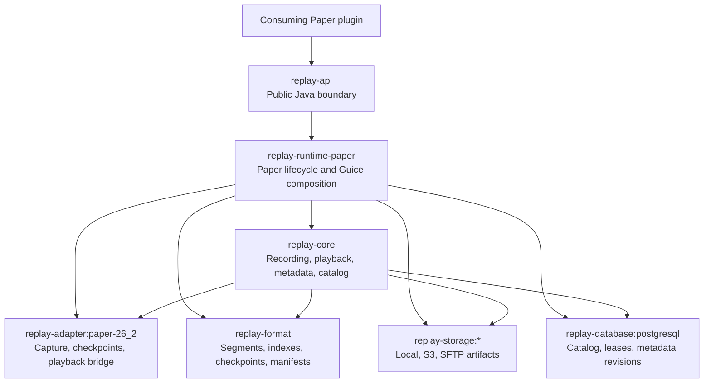
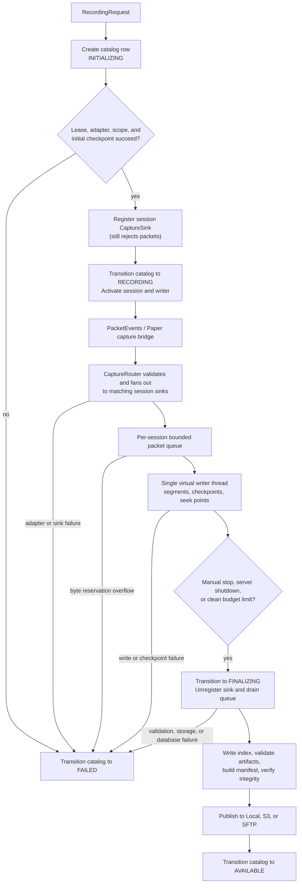
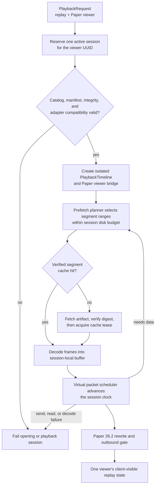

# Architecture

Replay Framework is a layered, multi-module Paper integration. The public API
isolates consuming plugins from the packet adapter, artifact format, storage,
and PostgreSQL persistence details.

## Module boundaries

Only `replay-api` is an integration dependency. The runtime creates the
adapter, constructs the dependency graph with Guice, runs Flyway before
Hibernate, then publishes a `ReplayFramework` facade to Paper's
`ServicesManager` and `ReplayFrameworkProvider`.

## Recording data flow

The adapter classifies and serializes supported raw network packets. The core
routes captured packets to each matching recording session, so overlapping
scopes remain isolated. A bounded queue prevents capture pressure from becoming
unbounded memory use. Segment rotation, checkpoints, and finalization are
internal mechanics; the public `RecordingSession` intentionally exposes only
progress inspection and `stop()`.

Artifacts are not published as playable until the finalizer drains queued data,
writes the required index and manifest, verifies integrity, and completes the
storage publication. Any failure in that chain produces `FAILED` instead of an
available partial recording.

The central `CaptureRouter` is deliberately lightweight because adapter capture
callbacks arrive synchronously on Netty's event loop. It looks up a registered
clientbound packet descriptor, rejects disallowed packets, creates a defensive
captured-packet value, and reads an atomic snapshot of active session sinks.
Registration uses a short lock, but delivery never waits for registration or
another session. A failure in one sink removes and fails only that recording;
the first fatal adapter failure is reported separately for all active sessions.

Each accepted sink owns a bounded multi-producer/single-consumer queue. A
producer reserves the packet payload bytes before publishing its entry, so a
queue overflow cannot be mistaken for a captured packet and is never silently
dropped. Producers never wait for writer capacity. The session instead fails
with `QUEUE_OVERFLOW`, protecting the server from unbounded capture pressure.
One virtual writer thread is the only owner of the session's format writers and
artifact lists; it drains the queue, rotates segments, consumes checkpoint
signals, and seals the artifacts after admission closes.

## Playback data flow

Each viewer receives a dedicated session. The playback engine reads only the
required replay ranges, maintains a session-local decoded buffer, and uses the
shared disk segment cache within configured limits. Seeking begins from the
nearest checkpoint at or before the target, then replays deltas through that
position. A virtual playback worker schedules due frames according to the
session's own clock and speed.

The Paper adapter owns packet-level viewer isolation. Application UX remains
outside the framework: integrations decide where a viewer stands, what controls
exist, and when normal player state is restored.

Playback opening reserves the viewer UUID before asynchronous work begins, so a
viewer cannot acquire two concurrent sessions while catalog and artifact work
is in flight. The runtime then verifies the replay artifact and adapter
boundary, creates the viewer bridge, and registers the session only after that
reservation exists. Terminal cleanup releases the session and viewer
reservation together.

The `PlaybackBuffer` asks the prefetch planner for ranges around the timeline
position. It retains data behind the viewer, preloads data ahead, scales the
forward window for the selected speed, and keeps the plan within the
session-local disk budget. `DiskSegmentCache` serves only complete,
integrity-checked immutable segments: a cache miss fetches to an inflight path,
verifies the digest, then atomically promotes a cacheable result. Each playback
session receives leases for the segments it uses, preventing an active segment
from being evicted.

Frame emission is driven by a virtual scheduler. It obtains decoded ranges from
the session-local buffer, orders frames by elapsed time, server tick, and
sequence number, and sends only frames after its cursor. If a needed range is
not immediately available, it pauses the clock and enters `BUFFERING`; when
the minimum resume window is available, it resumes only if the viewer still has
play intent. This separates the user's requested state from transient storage
latency.

## Catalog and metadata

PostgreSQL is the source of truth for replay lifecycle state, fixed replay
fields, typed metadata JSON, revision history, and recording leases. The
artifact backend is the source of replay payload bytes. The framework records
the selected backend and storage key with each catalog entry.

Metadata values are registered at runtime through typed keys. The core owns
conversion between typed API values and JSON; the repository owns the atomic
database transaction. Every committed metadata change stores a complete,
immutable snapshot in `metadata_revision`, enabling revision-aware audit and
recovery workflows.

## Lifecycle ownership

The Paper runtime is the only component that creates, installs, and shuts down
the framework facade. During shutdown it stops new recordings, attempts clean
recording finalization, closes playback sessions, releases leases, and then
closes shared cache, storage, and database resources in dependency order.

Consuming plugins must not create their own runtime graph or call the provider's
`install` or `clear` hooks. They should close subscriptions and viewer sessions
they own while handling their own Paper plugin shutdown.

## Intentional limitations

- The framework records raw Minecraft network packets, not a standardized video
  or cross-version replay format.
- Paper 26.2 is the only currently supported server and adapter version.
- There is no HTTP or REST API.
- There is no framework-owned GUI, hotbar, command tree, resource pack, or
  player-state policy.
- Replays require both compatible stored artifacts and a compatible adapter to
  be played safely.
