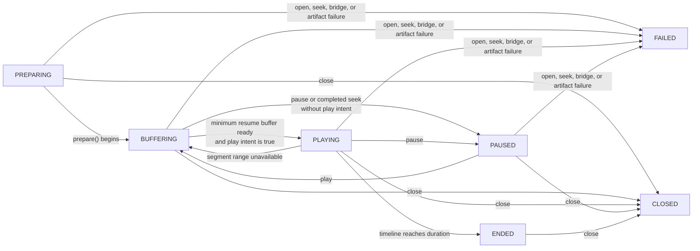

# Playback

Playback opens a replay for one Paper player. Every `PlaybackSession` owns an
independent position, play intent, speed, buffer window, and lifecycle. Two
viewers can watch the same replay without affecting one another.

The framework replays raw, adapter-bound packets. It owns the playback bridge,
timeline, buffering, and checkpoint reconstruction; your plugin owns the
viewer experience around it, including permissions, safe location, game mode,
inventory, hotbar, resource pack, and restoration of normal player state.

## Open a viewer session

Only an `AVAILABLE` replay can be opened. Supply the online Paper player and
session-local buffer options:

```java
PlaybackRequest request = PlaybackRequest.builder()
        .replay(replayId)
        .viewer(player)
        .buffer(framework.defaults().playbackBufferOptions())
        .build();

framework.playbacks().open(request).thenAccept(session -> {
    session.play();
});
```

`PlaybackService.open(...)` validates the replay and viewer boundary,
prepares the viewer bridge, and returns a `CompletionStage<PlaybackSession>`.
Handle failure asynchronously. The `Player` reference is used only at this
Paper-facing boundary; `PlaybackSession.viewerId()` provides the stable viewer
UUID thereafter.

An integration should arrange the viewer environment before opening playback
and undo it after `close()`, `ENDED`, or `FAILED`. The framework deliberately
does not teleport players, clear inventories, reserve worlds, or render
controls. `replay-example-plugin` demonstrates those optional responsibilities.

## Internal playback pipeline

Opening a replay first reserves the viewer UUID in the runtime coordinator.
This prevents two asynchronous opens from creating competing sessions for the
same player. The runtime then validates the catalog entry, verified artifact
manifest, and adapter compatibility, creates the Paper playback bridge, and
registers the session only when the reservation remains valid. A terminal
session releases both its session ID and viewer reservation.

The session owns a `PlaybackTimeline` that serializes control operations and a
separate virtual packet scheduler for frame emission. The timeline retains the
user's play intent separately from its current status: an intended playback can
become `BUFFERING` while storage work is pending, then resume automatically
only after the buffer reports that `minimumResumeBuffer` is available. A manual
pause clears the play intent, so a completed prefetch does not unexpectedly
resume a viewer who paused.

The prefetch planner selects immutable segments around the current position.
For forward playback it retains the configured history and preloads ahead; for
seeking it prioritizes the target range. The forward window is scaled by the
selected speed and every plan is constrained by the session-local disk budget.
The shared disk cache verifies segment digests on both cache hits and fetches,
coalesces concurrent fetches of the same digest, and gives sessions leases so
active segments cannot be evicted.

Decoded frames enter a session-local buffer. The virtual scheduler orders them
by elapsed time, server tick, and sequence, emits only frames beyond its
cursor, and sends them through the Paper viewer bridge. A buffer miss pauses
the virtual clock rather than advancing the timeline without packets. The
bridge applies the version-specific rewrite and outbound gating required to
keep replay packets confined to the intended viewer.

## Control the timeline

```java
session.play();
session.pause();
session.speed(PlaybackSpeed.DOUBLE);

session.seekBy(Duration.ofSeconds(-10));
session.seekTo(Duration.ofMinutes(2));
session.restart();
session.close();
```

- `play()`, `pause()`, and `speed(...)` are non-blocking and thread-safe.
- `restart()`, `seekTo(...)`, `seekBy(...)`, and `close()` return a completion
  stage with the resulting `PlaybackSnapshot`.
- Absolute and relative seeks are clamped to the range from zero through the
  replay duration.
- `restart()` preserves the current play intent.
- Repeated `close()` calls are idempotent.

Supported speeds are `QUARTER` (0.25x), `HALF` (0.5x), `NORMAL` (1x),
`DOUBLE` (2x), and `QUADRUPLE` (4x). Pause is an explicit state, not a
zero-speed setting.

Do not assume overlapping seek requests will all take effect. A newer seek can
supersede an in-flight seek; treat a failed or cancelled seek stage as a normal
control-race outcome and use the latest `snapshot()` for the current state.

## Interpret snapshots and states

`PlaybackSession.snapshot()` returns an immutable view containing the current
position, total duration, speed, state, and buffered time before and after the
position.



- `PREPARING`: replay metadata and the viewer bridge are being initialized.
- `BUFFERING`: checkpoint or segment data is loading.
- `PLAYING`: the virtual playback clock advances and due frames are emitted.
- `PAUSED`: the timeline is intentionally stopped but may retain or prefetch
  data.
- `ENDED`: the position reached the replay duration.
- `CLOSED`: resources were released and the session cannot be used again.
- `FAILED`: the session stopped after an artifact, bridge, or playback error.

Do not equate a full configured prefetch window with immediate playback. The
runtime needs at least `minimumResumeBuffer` before automatic resume after a
buffering transition.

## Seek reconstruction

A replay stores time-ordered packet segments plus periodic checkpoints. To seek
to a target, the runtime finds the closest checkpoint at or before that time,
ensures the relevant data is available, resets the viewer's replay view, emits
the checkpoint, then applies packet deltas through the requested position. This
reconstructs a coherent client-visible state without replaying the entire
recording from its beginning.

Internally, a seek first increments the timeline's operation generation,
suspends scheduled frame emission, and discards replay packets waiting in the
viewer bridge. The seek engine clamps the target to the replay duration, finds
the floor checkpoint in the index, plans and loads the required segment range,
then resets the bridge before it emits checkpoint frames and deltas. The
timeline updates its clock and scheduler cursor only after the bridge reports
its replay output idle. A newer seek invalidates an older generation, which is
why integrations must handle a superseded seek stage without treating it as a
replay corruption error.

This is why regular recording checkpoints and compatible adapter/protocol data
are essential. A damaged artifact, a missing floor checkpoint, or an
incompatible adapter prevents reliable playback and results in failure rather
than a best-effort partial view.

## Tune buffering per session

`PlaybackBufferOptions` controls session-local resources:

```java
PlaybackBufferOptions buffer = PlaybackBufferOptions.builder()
        .preloadAhead(Duration.ofSeconds(45))
        .retainBehind(Duration.ofSeconds(20))
        .minimumResumeBuffer(Duration.ofSeconds(3))
        .memoryBudgetBytes(128L * 1024 * 1024)
        .diskBudgetBytes(2L * 1024 * 1024 * 1024)
        .maxParallelFetches(4)
        .build();
```

All durations, byte budgets, and the fetch limit must be positive. Start with
the runtime defaults unless a particular audience or storage backend justifies
different resource use. Larger prefetch windows can improve remote-storage
playback but increase cache and memory pressure; use per-session budgets to
keep concurrent viewers predictable.

## Observe and clean up

`ReplayEventPublisher` emits playback status, speed, seek, buffer, and terminal
events. Events may run off the Paper thread, so schedule Bukkit UI updates on
the server thread. Always close sessions when a viewer leaves the replay
environment, disconnects, or your plugin disables; this releases the replay
bridge, buffers, and cache leases deterministically.
