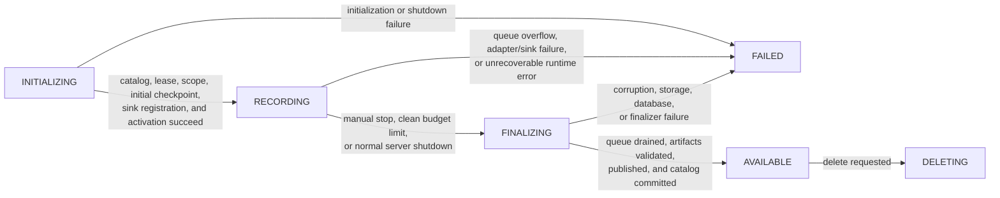

# Recording

The public recording API creates an isolated replay session. A request defines
what should be captured; the runtime resolves Paper worlds and chunks,
registers the packet sink, writes raw packet frames and checkpoints, and
publishes a replay only after finalization succeeds.

```java
RecordingRequest request = RecordingRequest.builder()
        .title("Tournament final")
        .description("Round three, north arena")
        .scope(scope)
        .capturePolicy(policy)
        .budget(framework.defaults().recordingBudget())
        .options(framework.defaults().recordingOptions())
        .participants(Set.of(player.getUniqueId()))
        .build();

framework.recordings().start(request).thenAccept(session -> {
    // Store session.id() or session.replayId(); do not block this callback.
});
```

`RecordingService.start(...)` returns a `CompletionStage<RecordingSession>`.
The session is available only after the runtime has created the catalog entry,
resolved the capture scope, installed its sink, and reached `RECORDING`.

## Define the capture scope

`RecordingScope` is a platform-neutral description of worlds and inclusive
block cuboids. It does not load worlds or chunks by itself.

```java
Key world = Key.key("minecraft:overworld");
RecordingScope scope = RecordingScope.builder()
        .addWorld(world)
        .addRegion(new CuboidRegion(
                world,
                new BlockPosition(-128, 60, -128),
                new BlockPosition(128, 180, 128)))
        .chunkLoadingPolicy(ChunkLoadingPolicy.PRELOAD_SCOPE)
        .build();
```

- Add one or more world keys to limit capture to those worlds.
- Add one or more `CuboidRegion` values to limit capture to inclusive,
  axis-aligned regions. `min` must not exceed `max` on any axis.
- An empty world and region selection means all worlds that are currently
  loaded when the scope is resolved.
- `LOADED_ONLY` captures only naturally loaded chunks.
- `PRELOAD_SCOPE` permits preloading, but requires at least one bounded region.

The scope controls the packet-capture area. It is not a viewer location, a
teleport target, or a player permission boundary.

## Select participants

`RecordingRequest.participants(...)` accepts player UUIDs for the replay's
selected participants. An empty set means all captured players in the resolved
scope are selected. A non-empty set does **not** turn the capture pipeline into
a player-only filter: packets for other visible players and entities can still
be required to reconstruct the recorded scene.

Use this field for application-level semantics such as highlighted players,
ownership, or later catalog presentation. It is independent from the caller
that started the recording and independent from eventual viewers.

## Configure packet capture

`CapturePolicy` controls public, per-recording choices. The version adapter
still rejects connection-control and unsupported packets regardless of the
policy.

```java
CapturePolicy policy = CapturePolicy.builder()
        .includeChat(false)
        .allowCustomPayload(Key.key("my_plugin:replay_marker"))
        .excludePacketCategory(CapturePolicy.PacketCategory.CONFIGURABLE)
        .build();
```

Available packet categories are `STATEFUL`, `EPHEMERAL`, and `CONFIGURABLE`.
Chat is included by default and may be filtered with `chatFilter(...)`. The
predicate is called on normalized chat text, so it must be non-blocking and
must not perform database, network, or Bukkit operations. Custom payload
capture is closed by default; explicitly allow every accepted channel.

## Set budgets and checkpoints

`ReplayBudget` separates required structural limits from optional session
limits. `maxSegmentBytes` is mandatory and rotates the uncompressed packet
stream into manageable segments. Optional limits include segment duration,
total duration, total bytes, packets, segments, queue bytes, and pending upload
bytes.

```java
ReplayBudget budget = ReplayBudget.builder()
        .maxSegmentBytes(64L * 1024 * 1024)
        .maxSegmentDuration(Duration.ofSeconds(30))
        .maxDuration(Duration.ofMinutes(10))
        .maxQueueBytes(32L * 1024 * 1024)
        .build();

RecordingOptions options = RecordingOptions.builder()
        .checkpointInterval(Duration.ofSeconds(30))
        .build();
```

All configured durations and numeric limits must be positive. If no
per-session limit is needed, begin with `framework.defaults()` and adjust only
the relevant fields. The checkpoint interval controls how frequently the
runtime takes a replayable world snapshot; checkpoints make restart and seeking
possible without replaying the entire recording from time zero.

Reaching a configured duration, byte, packet, or segment limit is a clean
completion, not an error. The result is finalized as `AVAILABLE` with the
corresponding completion reason.

## Monitor and stop a session

`RecordingSession` is the sole public mutable recording handle. It exposes
point-in-time metrics and one lifecycle operation: `stop()`.

```java
RecordingSession session = /* result of start(...) */;

RecordingSession.Metrics metrics = session.metrics();
logger.info("Captured " + metrics.packetCount() + " packets");

session.stop().thenAccept(terminal -> {
    if (terminal.status() == RecordingStatus.AVAILABLE) {
        // terminal.replayId() may now be opened for playback.
    } else {
        terminal.failureCode().ifPresent(code -> logger.warning(code.name()));
    }
});
```

`stop()` requests manual finalization. Repeated calls share the same result and
never start a second finalizer. A replay may be opened only when its terminal
recording status is `AVAILABLE`.

## Lifecycle and integrity

The recording state machine is owned by the runtime:



- `INITIALIZING`: catalog creation, scope resolution, and capture preparation.
- `RECORDING`: the session accepts captured packets.
- `FINALIZING`: capture has stopped; queues are drained, indexes and manifests
  are produced, artifact integrity is verified, and the artifact is published.
- `AVAILABLE`: artifact and catalog are ready for playback.
- `FAILED`: the replay is not playable. Inspect `failureCode()` and the safe
  diagnostic description.
- `DELETING`: the catalog entry and artifact are being removed.

Queue overflow, adapter failure, storage failure, database failure, corruption,
an incompatible adapter, an internal failure, or an interrupted server may
produce `FAILED`. The runtime does not publish a partial replay as available.
During normal server shutdown it first attempts clean finalization; a shutdown
timeout forces remaining recordings to fail instead of advertising uncertain
artifacts.

## Internal recording pipeline

`start(...)` is an asynchronous activation sequence rather than a direct
capture toggle. The coordinator first inserts the catalog row as
`INITIALIZING`, acquires the recording lease, verifies the selected adapter and
packet registry, resolves the platform scope, and asks the adapter to encode an
initial checkpoint at replay time zero. The initial checkpoint establishes the
state from which playback and later seeks can reconstruct the world.

The coordinator next constructs the session and registers its capture sink
*before* persisting the `RECORDING` transition. While the session remains
`INITIALIZING`, its sink rejects packets. This ordering closes the gap between
the catalog transition and capture registration without accepting packets that
the catalog does not yet describe as recorded. Once the transition succeeds,
the session activates its writer and periodic checkpoint scheduler.

Capture callbacks enter the central router on Netty's event loop. The router
uses the immutable sink snapshot to evaluate each session's resolved scope and
capture policy, then enqueues only matching packets. It does not perform
format writes, database work, or storage I/O on the capture callback. Each
session queue atomically reserves payload bytes before accepting an entry; if
the requested reservation exceeds its configured limit, the runtime fails that
recording with `QUEUE_OVERFLOW` rather than blocking the network thread or
discarding an apparently accepted frame.

A single virtual writer thread owns the session's artifact state. It drains the
queue in order, emits raw packet frames, rotates segments when structural
limits are reached, and records seek points. The checkpoint scheduler requests
regular snapshots from the adapter; dimension-transition signals can also cause
checkpoint work. Checkpoint frames and normal packet frames remain separate
artifact inputs so the playback engine can reset to a stable snapshot and then
apply only the required delta range.

Finalization stops new capture admission, unregisters the sink, and lets the
writer drain every packet already reserved by a racing producer. The finalizer
then transitions the catalog to `FINALIZING`, validates the sealed segment and
checkpoint lists, writes `index.bin`, enforces any pending-upload budget,
creates the manifest, publishes the artifacts, and commits the `AVAILABLE`
transition. It uses one finalization stage per session, so repeated `stop()`
calls cannot produce competing publication attempts.

## Observe lifecycle events

Subscribe to `framework.events()` when the integration needs status updates for
a UI or command feedback:

```java
ReplayEventPublisher.Subscription subscription = framework.events().subscribe(event -> {
    if (event instanceof ReplayEventPublisher.RecordingCompleted completed) {
        // Dispatch to the Paper thread before updating Bukkit UI.
    }
});
```

Events are transient notifications, not a durable journal, and listener
failures are isolated from framework operations. Close the subscription when
your plugin is disabled.
